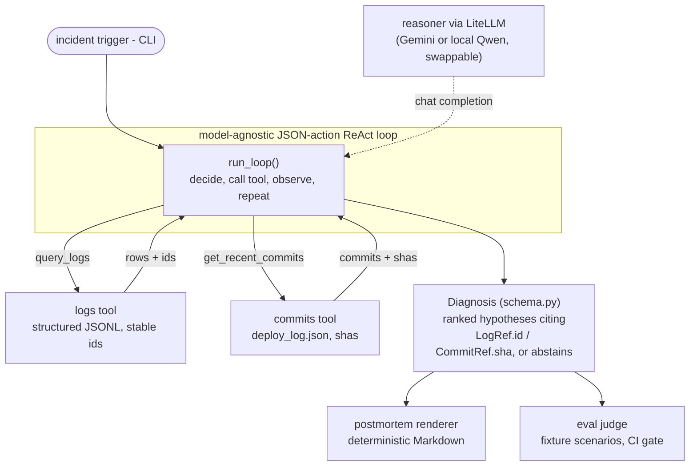

# Quellgeist

[](https://github.com/Rajeev-Shyam/Quellgeist/actions/workflows/ci.yml)
[](LICENSE)
[](https://www.python.org/downloads/)

> First-line incident triage you can trust: ranked root-cause hypotheses where **every claim cites a real evidence handle** — and the agent **abstains rather than guess**.

Quellgeist is a model-agnostic AI agent for first-line production-incident triage.
It runs a legible JSON-action ReAct loop over read-only tools (structured logs +
recent deploys), then emits a structured **Diagnosis**: confidence-ranked
root-cause hypotheses, each backed by a structured evidence handle
(`LogRef.id` / `CommitRef.sha`) the agent actually saw — never free text. Two
ideas set it apart:

- **Cite-by-structured-handle.** Evidence is a checkable handle, not a sentence,
  so a fabricated citation is *measurable* (and, from Wave 2, deterministically
  rejectable) rather than a matter of fuzzy string-matching.
- **Abstain-over-hallucinate.** A confidently-stated wrong cause is the worst
  possible answer, so *"insufficient evidence"* is a first-class outcome.

> **Status: WIP — Wave 1 (bad-deploy vertical slice).** The spine works
> end-to-end and is unit-tested; the loop currently *measures* citation fidelity
> (`cited_but_unseen`). Deterministic *enforcement* (a verifier pass + a
> fabrication check) is Wave 2. See [Status & roadmap](#status--roadmap).

## Why it's different

| | |
|---|---|
| **Evidence is a handle** | Each hypothesis cites a log row's source-stable `id` or a commit `sha`, copied verbatim from a tool result — the unit the (Wave 2) fabrication check looks up. Prose lives in a display-only `note`. (DR-0009) |
| **Abstention is a feature** | When signals are weak the agent returns `abstained=true` with a reason and an empty hypotheses list — enforced by the schema. |
| **Model-agnostic by construction** | The loop parses JSON actions from plain chat text, so it's identical on Gemini's free tier and a local 4-bit Qwen — no dependence on any backend's native function-calling. Swap models with one config change. (DR-0008, DR-0010) |
| **Reliability is gated, not asserted** | A keyless, deterministic CI gate (ruff + black + `pytest`, including the fixture-backed eval harness) runs on every push. |

## Quickstart (~30 seconds)

Requires [uv](https://docs.astral.sh/uv/) and Python 3.12+.

```bash
uv sync                                   # 1. install deps into a venv

uv run uvicorn demo.app.main:app          # 2. start the toy service (leave running)

# --- in a second shell, from the repo root ---
uv run python -m demo.chaos.bad_deploy    # 3. inject a simulated bad deploy
curl -s localhost:8000/login              # 4. trip /login -> 500s + structured error logs
uv run quellgeist diagnose --show-trace   # 5. diagnose (needs a model; see below)

uv run python -m demo.chaos.reset         # back to a green slate
```

Step 5 needs a reasoner — see [Running the model](#running-the-model). Without a
key, `quellgeist diagnose` degrades to a one-line error and exit 1 (never a
traceback); the [example session](#example-session) below shows the output shape
rendered deterministically from a fixture.

## Architecture

A custom, legible loop is the orchestration layer; the two read-only tools are
the evidence interface; the `Diagnosis` schema is the contract that the
postmortem renderer and the eval judge both read.



Both tools are also exposed as **MCP servers** over stdio
(`python -m quellgeist.servers.logs_mcp`, `…commits_mcp`). In Wave 1 the agent
reuses the same tool *functions* in-process behind a `ToolSpec` registry; a
stdio MCP-*client* path (the agent driving the servers over the wire) is on the
roadmap (DR-0010).

## Example session

Inject the bad deploy — it drops a marker that flips `verify_token` into a
NoneType regression and writes a `deploy_log.json` whose offending commit landed
just before the errors (real `stdout`, paths shown relative to the repo root):

```text
$ uv run python -m demo.chaos.bad_deploy
injected bad deploy a1b2c3d (touched demo/app/auth.py) at 2026-06-24T12:22:43Z
  marker:     demo/.bad_deploy
  deploy log: demo/deploy_log.json
next: hit /login to generate the 500s, then `quellgeist diagnose`
```

With a reasoner configured, `quellgeist diagnose` reads the logs + deploys and
emits a postmortem. The CI environment has no validated model key (DR-0012), so
the diagnosis below is **rendered from gold** — built deterministically from the
fixture's labelled cause and evidence handles via `render_postmortem`, *not*
live model output:

```text
# Incident Postmortem (rendered from gold)

## Root-cause hypotheses

### 1. Bad deploy a1b2c3d (10:01:50Z) refactored auth.py and introduced a NoneType error in verify_token; /login 500s begin ~20s later at 10:02:12Z.  (confidence: 1.00)

Evidence:
- log #2
- commit a1b2c3d
```

Reproduce that render yourself (no model needed):

```bash
uv run python - <<'PY'
from evals.scenarios.generator import load_scenario
from quellgeist.agent.schema import Diagnosis, Hypothesis
from quellgeist.output.postmortem import render_postmortem

s = load_scenario("evals/scenarios/fixtures/bad_deploy_0001.json")
gold = Diagnosis(hypotheses=[
    Hypothesis(cause=s.gold_cause, confidence=1.0, evidence=s.gold_evidence_refs)
])
print(render_postmortem(gold, title="Incident Postmortem (rendered from gold)"))
PY
```

The point isn't the prose — it's that **`log #2`** and **`commit a1b2c3d`** are
exact handles into the real signals, not paraphrases. A live run additionally
fills in a one-line summary and suggested actions, and abstains outright when the
evidence is too weak to name a confident cause.

## Running the model

The reasoner is any [LiteLLM](https://docs.litellm.ai/) model string, selected by
`--model` or the `QG_MODEL` env var (default `gemini/gemini-2.0-flash`). Provider
keys are read from the environment by LiteLLM; nothing is stored in the repo.

```bash
export QG_MODEL="gemini/gemini-2.0-flash"
export GEMINI_API_KEY="…"        # or run a local model via Ollama
uv run quellgeist diagnose --show-trace
```

Heads-up (DR-0012): a Gemini key on an unvalidated, no-billing project returns
`429 limit: 0` on current models, so the shipped CI gate is deliberately
**keyless** and model-driven evals are key-gated for Wave 2. At home the intended
default reasoner is a local **Qwen3-4B** via Ollama (DR-0008).

## Status & roadmap

Built in **rolling waves** — only the current wave is implemented in detail
(see [`docs/quellgeist-plan-rolling-wave.md`](docs/quellgeist-plan-rolling-wave.md)).
The full decision history lives in the
[**ADR log**](docs/quellgeist-adr-log.md).

| Wave | Scope | Status |
|---|---|---|
| 0 | De-risk the model bet (4B can orchestrate the loop) | ✅ done — default = Qwen3-4B (DR-0008) |
| **1** | **Bad-deploy slice: demo → break → diagnose → postmortem; eval harness + CI** | 🚧 **current** — spine built & unit-tested; loop *measures* fidelity |
| 2 | Reliability core: verifier pass, deterministic fabrication check, abstention, LLM-as-judge | ⏳ deferred |
| 3 | Breadth: config/env + resource-exhaustion classes, metrics, ~50 scenarios | ⏳ deferred |
| 4 | Cost / fine-tune: QLoRA Qwen3-4B vs base vs frontier, with/without verifier | ⏳ deferred |
| 5 | Polish & ship: HTML render, security pass, MCP registry, launch | ⏳ deferred |
| 6 | Resolution-verification loop | ⏳ cut-first |

Deferred features carry `NotImplementedError` stubs on purpose — the Wave-1
boundary is deliberate, not unfinished.

## Reliability gate

The deterministic CI gate is the reliability contract: **44 tests** (ruff +
black via pre-commit, then `pytest` — covering the loop's never-crash /
graceful-abstention behaviour, the citation-fidelity measurement, the server
filters, the postmortem renderer, and the fixture-backed eval harness) on
Python 3.12 and 3.13.

```bash
uv run pytest tests/ -q
uv run pre-commit run --all-files
```

## Development & contributing

See [CONTRIBUTING.md](CONTRIBUTING.md) for the dev setup, conventions, and the
wave model, and [SECURITY.md](SECURITY.md) for reporting and the no-secrets /
toy-demo policy.

## License

[MIT](LICENSE) © Rajeev Shyam Kumar.
