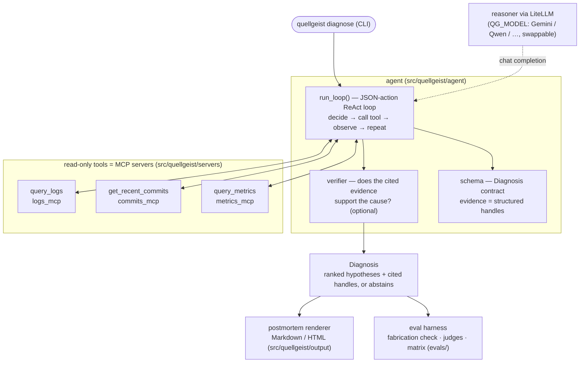
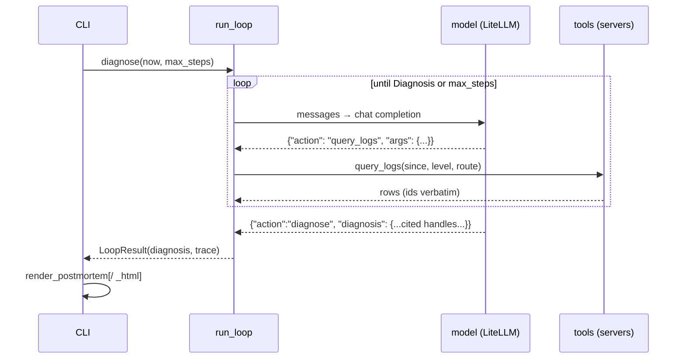

# Quellgeist — Architecture

Quellgeist is a model-agnostic incident-triage agent. It runs a legible
JSON-action ReAct loop over three read-only evidence tools, gates the result
through layered reliability checks, and renders a cited postmortem. This doc is
the map; the load-bearing *why* for each choice lives in the
[ADR log](quellgeist-adr-log.md) (the `DR-00xx` references below), and the build
sequence in the [rolling-wave plan](quellgeist-plan-rolling-wave.md).

## The one-paragraph version

A trigger (the CLI) starts `run_loop`, which asks the configured model for a JSON
*action*, executes it against a read-only tool, feeds the observation back, and
repeats until the model emits a `Diagnosis`. Every hypothesis in that Diagnosis
cites evidence as a **structured handle** (`LogRef.id` / `CommitRef.sha` /
`MetricRef.id`) copied verbatim from a tool result — never free text. The
Diagnosis then passes through reliability layers (a deterministic fabrication
check, an optional model verifier, an advisory LLM-judge) and is rendered to a
Markdown or HTML postmortem. The model is a config value, so the same loop runs on
a hosted frontier model or a local 4-bit Qwen with one environment variable.

## Components

## The pipeline, step by step

1. **Trigger — `cli.py`.** `quellgeist diagnose` builds a `Provider` and the tool
   registry, then calls `run_loop`. stdout carries only the postmortem (a clean,
   pipeable artifact); stderr carries diagnostics. A provider failure (model down,
   quota, missing key) degrades to a one-line error and exit 1 — never a
   traceback. Abstention is a valid outcome and exits 0.

2. **Reason — `agent/loop.py`.** The loop is a **JSON-action ReAct** loop: the
   model emits `{"action": …, "args": …}` as *text*, and we parse it — we never
   depend on a backend's native function-calling, whose support and quality vary
   across Gemini and a 4-bit Qwen on Ollama (DR-0010). Each step runs one tool and
   feeds the observation back. A schema-invalid model reply becomes a bounded
   retry, then a graceful abstention. The loop returns a `LoopResult` — the
   Diagnosis plus a fidelity trace (schema violations; handles cited vs. actually
   seen) so citation fidelity is *measurable* (DR-0009).

3. **Gather evidence — `servers/`.** Three tools narrow the same canned signals:
   `query_logs` (structured JSONL), `get_recent_commits` (deploy log), and
   `query_metrics` (time-series, for resource-exhaustion incidents). Ids/shas/metric
   names pass through **verbatim**, never renumbered by result position — an evidence
   handle must resolve to the same row regardless of the query (DR-0009). The shared
   filtering lives in one module, `servers/filters.py`, so the servers and the eval
   harness narrow signals identically.

4. **Contract — `agent/schema.py`.** The `Diagnosis` is the seam everything else
   reads: a summary, ranked `Hypothesis` objects (each with `confidence` and ≥1
   evidence handle), suggested actions — or `abstained=True` with a reason and an
   empty hypotheses list, enforced by a model validator. Evidence is a discriminated
   union of `LogRef` / `CommitRef` / `MetricRef`; the id/sha/name is *checked*, the
   `note` is display-only gloss.

5. **Verify — `agent/verifier.py` (optional).** A (stronger) model re-reads each
   hypothesis against the evidence it cites and confirms *support*. Unsupported
   hypotheses are dropped; if none survive, the diagnosis is forced to a graceful
   abstention. It is conservative by design — an unresolvable handle or an
   unparseable verdict counts *against* support (abstain over confirm). Enabled with
   `QG_VERIFY=1`.

6. **Render — `output/postmortem.py`.** A pure, deterministic, model-free render of
   the Diagnosis to **Markdown or HTML** (`--format md|html`). Both formats read the
   same fields and share one evidence-handle helper, so they can't drift; a parity
   test guards it. The abstained case renders explicitly, never as an empty report.

### A diagnose run, as a sequence

## Cross-cutting design

- **Model-agnostic by construction (DR-0008/DR-0010).** The reasoner is any
  [LiteLLM](https://docs.litellm.ai/) model string, chosen by `--model` or
  `QG_MODEL`. Because the loop parses JSON actions from plain text, swapping a
  hosted frontier model for a local Qwen3-4B is a one-line config change — the
  property the whole cost thesis rests on.

- **Reliability is layered and mostly keyless (DR-0003).** Three independent
  guards: a **deterministic fabrication check** (`evals/fabrication_check.py`) —
  every cited handle must exist in the real signal set, fail-closed, no model
  needed; the **verifier** (support); and an advisory **LLM-judge**
  (`evals/llm_judge.py`, validated against a human-labelled subset at Cohen's
  κ 0.81, DR-0018). The keyless deterministic gate is the reliability contract;
  the model-driven pieces are opt-in and out-of-band.

- **Read-only, least-privilege tools (DR-0011, [SECURITY.md](../SECURITY.md)).**
  The servers only read one operator-configured local file each, over stdio, with
  no network and no write path. Tool arguments never choose the file path, so there
  is no traversal surface. `bandit` + `pip-audit` run in a dedicated CI workflow.

- **Train/eval separation is absolute (DR-0003/DR-0020).** The fine-tune trains on
  the fixtures *distribution*; the 16-scenario **holdout** (disjoint token banks) is
  never trained on and selected only explicitly (`QG_SCENARIOS_DIR`). The headline
  number is measured on the holdout, so it measures skill transfer, not
  memorisation — triangulated three ways in the
  [fine-tune case study](case-studies/wave4-qwen-finetune.md).

## Module map

| Path | Responsibility |
|---|---|
| `src/quellgeist/cli.py` | `quellgeist diagnose` entry point |
| `src/quellgeist/agent/loop.py` | JSON-action ReAct loop → `LoopResult` |
| `src/quellgeist/agent/providers.py` | LiteLLM provider seam; retry/backoff; usage records |
| `src/quellgeist/agent/schema.py` | `Diagnosis` / `Hypothesis` / evidence-handle contract |
| `src/quellgeist/agent/verifier.py` | model verifier (evidence-supports-cause) |
| `src/quellgeist/servers/` | the three read-only MCP servers + shared filters |
| `src/quellgeist/output/postmortem.py` | deterministic Markdown / HTML render |
| `evals/` | fabrication check, keyword + LLM judges, judge validation, comparison matrix |
| `evals/training/`, `finetune/` | DR-0020 trajectory builder, probes, QLoRA pipeline |
| `demo/` | intentionally-toy FastAPI service + chaos scripts that produce signals |

## See also

- [ADR log](quellgeist-adr-log.md) — every load-bearing decision (`DR-0001`…).
- [Rolling-wave plan](quellgeist-plan-rolling-wave.md) — what's built and what's next.
- [Case studies](case-studies/) — the reliability rate, judge validation, and the
  Wave-4 fine-tune result.
- [SECURITY.md](../SECURITY.md) — threat model and scanning.
