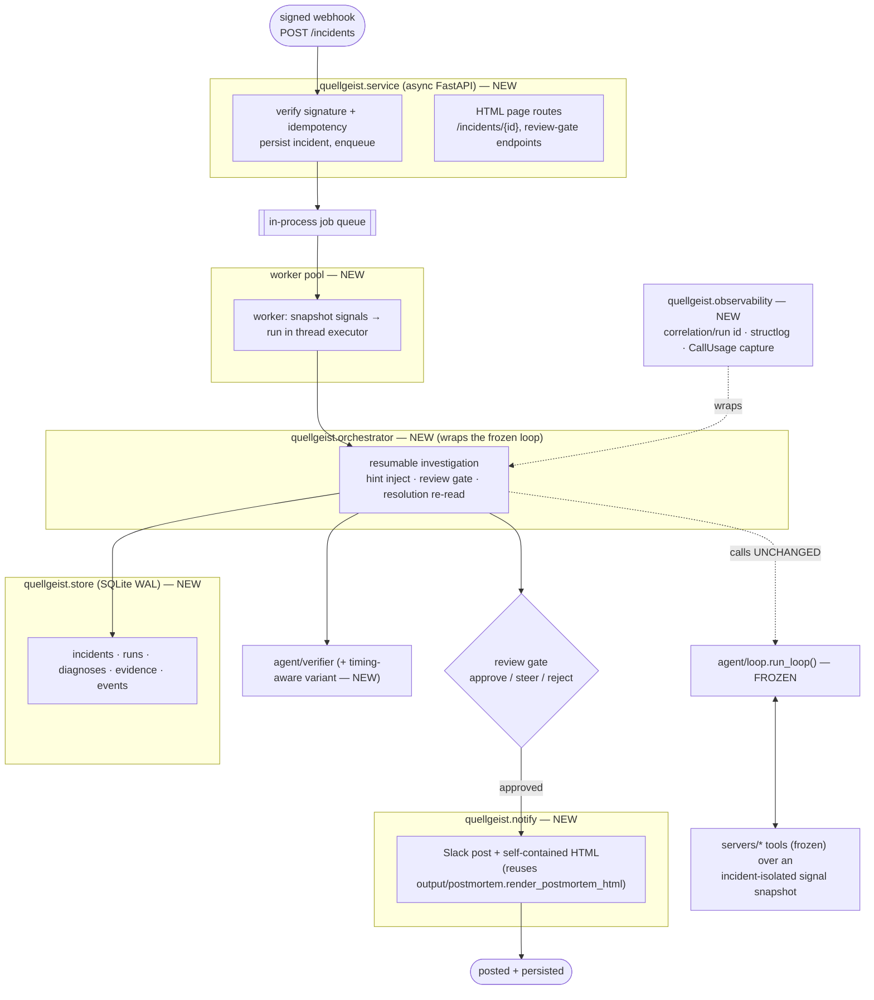
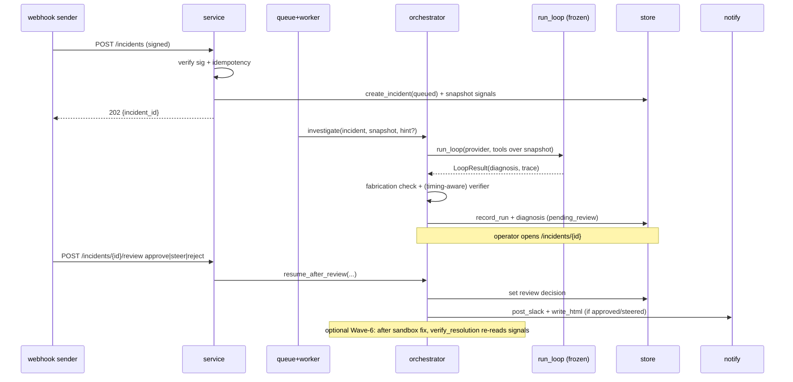

# Quellgeist v2 — Design Spec (live incident-response service + generalization track)

> Companion to [DR-0023](quellgeist-adr-log.md). This is the map for Wave 7+; the
> load-bearing *why* is in the ADR, the execution order + guardrails are in
> [`quellgeist-v2-session-brief.md`](quellgeist-v2-session-brief.md). Grounded on
> repo state at commit `0af7090` (2026-07-09), confirmed latest.

## The one-paragraph version

v1 is a stateless, single-incident, synchronous CLI. v2 wraps that proven core in a
**live service**: a signed webhook triggers an investigation, a worker pool runs the
*unchanged* synchronous `run_loop` concurrently, every run is persisted to SQLite with
its full trace and cost, an operator can inject a hint or approve/steer/reject the
diagnosis before it posts, results go to Slack **and** a self-contained HTML page, and
after a sandbox fix the agent re-reads signals to confirm recovery. A parallel
reliability track adds a timing-aware verifier and a genuine out-of-structure
generalisation eval. **Everything is additive; the frozen DR-0020 measurement surface is
never touched.**

## Goals / Non-goals

**Goals**
- Trigger → diagnose → persist → (review) → post → verify-recovery, end-to-end, in ~3 min.
- Handle **concurrent** incidents without corrupting each other's evidence.
- **Self-observability**: correlation/run ids, structured logs, persisted run records + cost.
- **HITL**: operator hint injection + a pre-post review gate.
- **Wave 6** resolution-verification (sandbox only, no prod mutation).
- Ship a **Dockerfile**.
- Reliability: **timing-aware verifier**; **out-of-structure** generalisation eval.

**Non-goals (YAGNI / deferred)**
- Rewriting or making `run_loop` async/interruptible.
- A new evidence type (traces/k8s/alerts) — frozen three only.
- The MCP-client wire path (agent driving stdio servers) — nice-to-have.
- Postgres / multi-node / autoscaling.
- A live metrics dashboard (offline matrix suffices).
- Autonomous production remediation (permanent boundary, DR-0001).

## The frozen surface — DO NOT TOUCH

Changing any of these invalidates the 0/16→12/16 comparison. This section is normative.

| Frozen artifact | Where | Why |
|---|---|---|
| Tool description strings (`QUERY_LOGS_DESC`, `GET_RECENT_COMMITS_DESC`, `QUERY_METRICS_DESC`) | `src/quellgeist/servers/tools.py` | byte-identical to the fine-tune's train/serve prompt (DR-0020) |
| Evidence schema + field order (`LogRef`/`CommitRef`/`MetricRef`/`Hypothesis`/`Diagnosis`) | `src/quellgeist/agent/schema.py` | the model emits this exact JSON; reordering re-skews the tune |
| Committed corpora | `evals/scenarios/fixtures/`, `evals/scenarios/holdout/` | the measured train/holdout split (DR-0003/DR-0020) |
| Observation + retry string format (`f"Observation from {action}: {json.dumps(rows)}"`, `_retry_msg`) | `src/quellgeist/agent/loop.py` | byte-identical to training turns |
| Shared filters | `src/quellgeist/servers/filters.py` | on the frozen eval path (`run_evals.scenario_tools` → `filters` over in-memory fixtures) |
| `run_loop` behaviour | `src/quellgeist/agent/loop.py` | the measured artifact; v2 wraps it, never edits its decision logic |

**Rule:** v2 code lives in **new modules** (`service/`, `orchestrator/`, `store/`,
`observability/`, `notify/`) and **new eval axes** (new corpora dirs, a new verifier
variant). Reuse the frozen modules by calling them; do not edit them. A regression test
(below) asserts the frozen tool strings and the eval path stay byte-identical.

## Architecture



## Components (each: purpose · interface · dependencies)

Designed for isolation — each new unit has one purpose, a defined interface, and can be
tested independently.

### `quellgeist.service` (new)
- **Purpose:** async HTTP ingress + the operator HTML surface.
- **Interface:** `POST /incidents` (signed trigger → 202 + incident id), `GET /healthz`,
  `GET /incidents/{id}` (HTML page), `POST /incidents/{id}/hint`,
  `POST /incidents/{id}/review` (`approve|steer|reject` + optional steer text). FastAPI app
  factory `create_app(deps)`.
- **Depends on:** `store`, the job queue, `observability`. **Not** on the loop directly.
- **Notes:** webhook signature (HMAC over the raw body with a shared secret from env) is
  verified before any work; an **idempotency key** (incident id / delivery id) dedupes
  duplicate deliveries.

### `quellgeist.orchestrator` (new)
- **Purpose:** the resumable investigation around the frozen loop — the only place that
  knows about hints, the review gate, and Wave-6 resolution.
- **Interface:** `investigate(incident, signals, *, hint=None) -> RunRecord`;
  `resume_after_review(run_id, decision, steer=None) -> RunRecord`;
  `verify_resolution(incident, run_id) -> ResolutionVerdict`.
- **Depends on:** `agent/loop.run_loop` (unchanged), `agent/verifier` (+ timing-aware
  variant), `agent/citations`, `store`, `observability`.
- **Design:** the default path calls `run_loop` exactly as the CLI does. A **hint** is
  injected only as an extra *operator* message the orchestrator adds **around** the frozen
  loop (either a pre-loop trigger annotation or a between-steps observation-style note via a
  thin step driver) — it never edits the frozen system prompt / observation strings. After
  the loop returns a `Diagnosis`, the orchestrator runs the deterministic fabrication check
  and the (optionally timing-aware) verifier, then enters `pending_review`.

### `quellgeist.store` (new)
- **Purpose:** durable record of everything.
- **Interface:** DAO functions (`create_incident`, `record_run`, `append_event`,
  `set_review`, `get_incident`, `list_runs`, …); a `connect()` returning a WAL-mode SQLite
  connection; forward-only `migrations/`.
- **Schema (DDL):**

```sql
CREATE TABLE incidents (
  id            TEXT PRIMARY KEY,          -- idempotency key (webhook delivery/incident id)
  source        TEXT NOT NULL,            -- 'webhook' | 'cli' | 'poll'
  received_ts   TEXT NOT NULL,            -- canonical UTC
  signals_ref   TEXT NOT NULL,            -- path to the isolated snapshot dir
  status        TEXT NOT NULL,            -- queued|running|pending_review|posted|rejected|failed
  hint          TEXT
);
CREATE TABLE runs (
  id            TEXT PRIMARY KEY,
  incident_id   TEXT NOT NULL REFERENCES incidents(id),
  model         TEXT NOT NULL,
  started_ts    TEXT NOT NULL,
  ended_ts      TEXT,
  steps         INTEGER,
  outcome       TEXT NOT NULL,            -- diagnosed | abstained | failed
  abstained     INTEGER NOT NULL DEFAULT 0,
  fabricated    TEXT,                     -- '' clean | JSON list of fabricated handles | NULL unverified
  prompt_tokens INTEGER, completion_tokens INTEGER, latency_s REAL,   -- summed CallUsage
  trace_json    TEXT                       -- full LoopResult transcript (messages/tool_calls/violations)
);
CREATE TABLE diagnoses (
  run_id        TEXT PRIMARY KEY REFERENCES runs(id),
  summary       TEXT, diagnosis_json TEXT NOT NULL,
  verified_json TEXT,                      -- post-verifier diagnosis (may force abstention)
  reviewed_by   TEXT, review_decision TEXT, steer_text TEXT
);
CREATE TABLE evidence (
  run_id TEXT NOT NULL REFERENCES runs(id),
  hyp_index INTEGER NOT NULL, handle_type TEXT NOT NULL, handle_id TEXT NOT NULL,
  PRIMARY KEY (run_id, hyp_index, handle_type, handle_id)
);
CREATE TABLE events (                       -- append-only audit log
  id INTEGER PRIMARY KEY AUTOINCREMENT,
  incident_id TEXT NOT NULL, run_id TEXT, ts TEXT NOT NULL,
  kind TEXT NOT NULL, detail_json TEXT
);
```

### `quellgeist.observability` (new)
- **Purpose:** correlation ids + structured logs + cost capture, threaded through a run.
- **Interface:** `run_context(incident_id) -> contextmanager` (binds a `run_id` +
  `incident_id` into a `contextvars`-backed structlog context); `summarize_usage(provider)
  -> UsageSummary` (sums the provider's `CallUsage` list); `attach(run_record, usage)`.
- **Depends on:** `structlog` (already a dep), `agent/providers.CallUsage`.
- **Design:** the provider already records `CallUsage` per call in memory; observability
  reads that list after the run and persists the sum — **no change to `providers.py`'s
  measured behaviour**. Logs are JSON with `incident_id`/`run_id`/`step` fields.

### `quellgeist.notify` (new)
- **Purpose:** emit the result to Slack + HTML.
- **Interface:** `post_slack(diagnosis, incident) -> None` (idempotent per incident);
  `write_html(diagnosis, path) -> None` (delegates to
  `output/postmortem.render_postmortem_html`).
- **Depends on:** `output/postmortem` (reused), an HTTP client for Slack (the **only** new
  network egress in the codebase — scoped to the Slack webhook URL from env).

### Reused unchanged
`agent/loop.py` (frozen), `agent/verifier.py` (extended with a new variant, original path
intact), `agent/citations.py`, `servers/*`, `ingest/*`, `output/postmortem.py`.

## Data flow (sequence)



## Concurrency model

- **Isolation per incident (correctness-critical).** On accept, the service **snapshots** the
  incident's signal files into a per-incident directory and points that run's tools at the
  snapshot via the existing `QG_LOG_PATH`/`QG_DEPLOY_LOG`/`QG_METRICS_PATH` env seam **scoped
  to the worker** (not process-global). Two concurrent incidents never read each other's
  signals. (The current global-env pattern in `servers/tools.py` is read-only and unchanged;
  the worker sets the env for its own call context.)
- **Workers.** A bounded worker pool pulls from the in-process queue; each worker runs the
  **synchronous** `run_loop` in a thread executor so the async event loop stays responsive.
  The loop is CPU-light (it waits on model I/O), so a threadpool is the right primitive; no
  async rewrite of the loop.
- **SQLite WAL.** One writer, many readers; the DAO uses short transactions. WAL is enabled at
  `connect()`. Sufficient for demo/portfolio concurrency.
- **Idempotency.** `incidents.id` is the delivery/incident id; a duplicate `POST` is a no-op
  returning the existing incident.

## HITL protocol

- **Hint at trigger:** the webhook body may carry an operator `hint`; stored on the incident,
  passed to `investigate`.
- **Hint between steps (optional, stretch):** a thin step driver that calls the frozen loop's
  building blocks and lets the operator add a note as an extra observation-style message —
  **without** altering the frozen system prompt or the `Observation from …:` format. If this
  proves to touch frozen strings, fall back to trigger-time hints only.
- **Review gate states:** `pending_review → approved | steered | rejected → posted`. `steer`
  re-runs `investigate` with the steer text as a hint; `reject` records the decision and posts
  nothing. All transitions are `events` rows.

## Wave 6 — resolution-verification (sandbox only)

After a controlled fix is applied to the **demo** service (a new chaos "fix" script or a
reset), `verify_resolution` re-reads signals and asserts the error signature is gone / metrics
recovered, appending a `ResolutionVerdict` (`recovered | not_recovered | inconclusive`) to the
run. **No production mutation** — this only observes the sandbox.

## Reliability track (parallel, additive)

- **Timing-aware verifier (DR-0024).** A verifier variant that, in addition to the support
  check, flags a hypothesis whose cited commit **landed after** the first cited error
  timestamp (the culprit-after-errors trap the current verifier misses). Pinned separately;
  measured against the **frozen holdout** + new abstention probes; the original verifier path
  stays intact and default.
- **Structure-varied corpus + public-postmortem holdout (DR-0025).** New corpus generators that
  vary the skeleton the two current corpora share (commit count, culprit position, decoy shape,
  error-route cardinality, log length), **in new directories** — never touching
  `fixtures/`/`holdout/`. A small **out-of-structure** holdout is **curated from public outage
  writeups** (structure/shape only, **paraphrased with attribution, never verbatim** — copyright)
  and normalised via `ingest`. **Measurement discipline:** any new fine-tune reports the frozen
  holdout number (comparability) **and** the new out-of-structure number (generalisation); the
  frozen holdout is never trained on and never mixed with the new corpora.
- **`resource_exhaustion` mix (DR-0026, optional).** Targeted trajectories if pursued; interim
  safety is the verifier's forced abstention. Model stays 4B.

## Error handling

- **Bad signature / malformed webhook** → 401/400, nothing enqueued, an `events` row.
- **Provider down / quota / missing key** → the loop already degrades to a graceful abstention;
  the run is persisted with `outcome=failed`/`abstained` and a reason — never a crash, never a
  half-posted result.
- **Fabricated citation** → persisted in `runs.fabricated`; **the service defaults to fail-closed**
  (do not post a fabricated diagnosis; surface it for review) — stricter than the CLI's
  warn-by-default, appropriate for an autonomous poster.
- **Store failure** → the run still returns to the caller; a retry/backoff on the DAO; a failed
  persist is logged and does not lose the diagnosis (kept in the event log).
- **Partial post** (Slack ok, HTML fails or vice-versa) → idempotent retries; posting is tracked
  per channel in `events`.

## Security (public repo)

- **Secrets env-only:** Slack token, webhook signing secret, provider keys — never committed;
  documented in `.env.example` with placeholders; `.env*` already git-ignored.
- **Signed webhooks:** HMAC verification on the raw body before any work.
- **Network egress:** the **only** new outbound is the Slack post (scoped URL from env) and the
  existing LiteLLM model call; the three read-only tools remain no-network (SECURITY.md holds).
- **HTML XSS:** model-authored text is already HTML-escaped by `render_postmortem_html` (tested);
  reused unchanged.
- **Threat-model additions to SECURITY.md:** the webhook ingress (auth, replay/idempotency), the
  Slack egress (token scope), and the operator HTML endpoints (no destructive actions; review-gate
  actions are the only writes and are authenticated).

## Observability spec

Per run, persisted + logged: `incident_id`, `run_id`, `model`, `steps`, `outcome`,
`abstained`, fabricated-handles, summed `prompt/completion tokens` + `latency_s`, and the full
`LoopResult` transcript. Logs are JSON, one line per step, correlation-tagged. **No dashboard**
— the store + HTML page are the views; the offline matrix stays the analytics tool.

## Testing strategy

- **Unit, per new module:** service (signature verify, idempotency, routes), orchestrator (hint
  injection, review-gate transitions, resolution verdict), store (DAO + migrations + WAL),
  observability (context + usage summary), notify (Slack payload shape, HTML delegation).
- **Concurrency:** N concurrent incidents assert isolated snapshots (no cross-read) and correct
  per-incident persistence.
- **E2E (CI-safe, keyless):** a scripted-provider harness — `POST /incidents` → worker →
  orchestrator → store → (auto-approve) → notify (stubbed) — asserting a correct cited diagnosis,
  zero fabrication, and a complete run record. Mirrors the existing `tests/e2e/` real-shaped
  pattern.
- **Frozen-surface regression (anti-drift):** a test asserting the three tool description strings
  and the loop's observation/retry format are byte-identical to a committed golden, and that the
  existing eval path (`run_evals.scenario_tools`) still imports and runs unchanged.
- **Reliability track:** the timing-aware verifier's new probes; the structure-varied + out-of-
  structure evals reported alongside (never gating the deterministic merge gate).
- Keep the **deterministic keyless CI gate green** throughout; model-driven evals stay out-of-band.

## Deployment

- **Dockerfile** for the service (Python 3.12+, `uv sync`, non-root, `CMD uvicorn
  quellgeist.service:app`).
- **`compose.yml`** (local dev): the demo service + the agent service + Ollama, with a shared
  volume for signals and the SQLite file.
- **Env:** `QG_MODEL`, provider key, `QG_SLACK_WEBHOOK_URL`, `QG_WEBHOOK_SECRET`, `QG_DB_PATH`,
  `QG_SIGNALS_DIR`. All documented in `.env.example`.

## Rollout as waves (Track A primary, Track B parallel)

- **Wave 7 — Service spine + persistence + observability.** `store`, `observability`, `service`
  (webhook + healthz), worker pool + isolated snapshots, run persistence. Acceptance: a signed
  `POST` produces a persisted, correlation-logged run; concurrency test passes; frozen-surface
  regression green.
- **Wave 8 — Output + HITL.** `notify` (Slack + HTML page), the review gate, hint-at-trigger.
  Acceptance: approved diagnosis posts to both surfaces idempotently; reject posts nothing; all
  transitions audited.
- **Wave 9 — Resolution-verification (Wave-6 content) + Dockerfile + compose.** Acceptance:
  post-sandbox-fix re-read yields a resolution verdict; `docker build` + `compose up` runs the
  3-min demo.
- **Wave 10 (Track B) — Timing-aware verifier + structure-varied/out-of-structure evals** (+
  optional `resource_exhaustion` mix). Acceptance: verifier probes pass; new evals reported with
  the frozen holdout still cited for comparability.

Each wave gets a boundary review (the existing checklist) and its DR opened at kickoff.

## Open judgment calls (flagged for confirmation — defaults chosen from "No preference")

1. **SQLite** (not Postgres) — default from Q6 no-pref; rationale above. Confirm.
2. **Async only in the service layer**, sync core wrapped in a threadpool — resolves Q26 no-pref.
   Confirm you're happy the core loop stays sync.
3. **Keep Quellgeist distinct from Aperture** — default from Q19 no-pref; the two stay separate
   projects. Confirm.
4. **v2 on a `v2` branch, merged for a combined launch** — reconciles Q24 (in-repo Wave 7+) with
   Q20 (launch together) and sane git hygiene. Confirm.
5. **`resource_exhaustion` mix is optional** — default from Q10 no-pref despite GPU budget (Q11);
   the verifier abstention is the interim safety. Confirm whether you want it in Track B or dropped.

## Adversarial self-review (done before commit)

- *"Does anything here edit the frozen path?"* No — all new modules/dirs; the frozen-surface
  regression test enforces it. Hint injection is the one risk: mitigated by falling back to
  trigger-time hints if between-steps injection would touch frozen strings.
- *"Can two incidents corrupt each other?"* Addressed by per-incident signal snapshots + worker-
  scoped env, not process-global paths.
- *"Is the offline claim still honest?"* Yes if the offline column's verifier stays the **local**
  artifact — called out in DR-0023 Notes.
- *"Is the generalisation claim honest?"* Only if the out-of-structure holdout is truly disjoint
  from the frozen holdout and the frozen number is still reported — encoded in DR-0025's discipline.
- *"Scope creep?"* Cut: no new evidence type, no MCP-client path, no Postgres, no dashboard — all
  explicitly deferred.
- *"Placeholders / TBDs?"* None; the one `resource_exhaustion` item is deliberately marked optional,
  not vague.
